# Objective 0 - Logging in & Navigating the AWS Console Page

1) Find your credential email with subject: **NCBI Codethon Credentials**

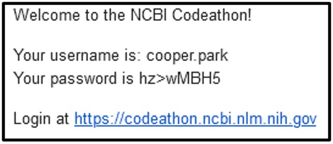

2) Navigate to [https://codeathon.ncbi.nlm.nih.gov](https://codeathon.ncbi.nlm.nih.gov) and login using the credentials from the email *(left image)* and create a new password after logging in *(right image)*

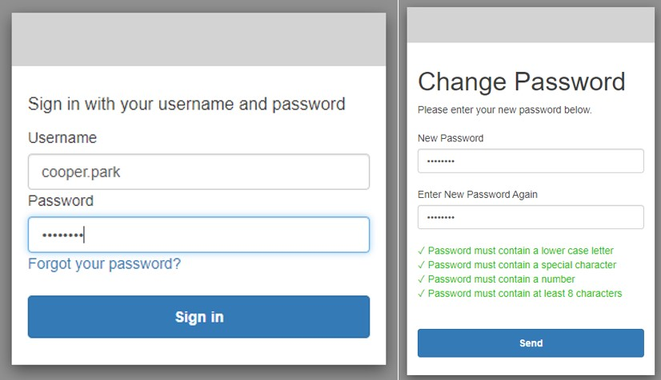


3) Click **Sign-In** under the AWS Console Sign-In column on the new page

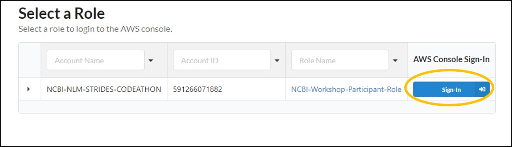

4) If you see **AWS Management Console** like the screenshot below, you have successfully logged in to the AWS Console!

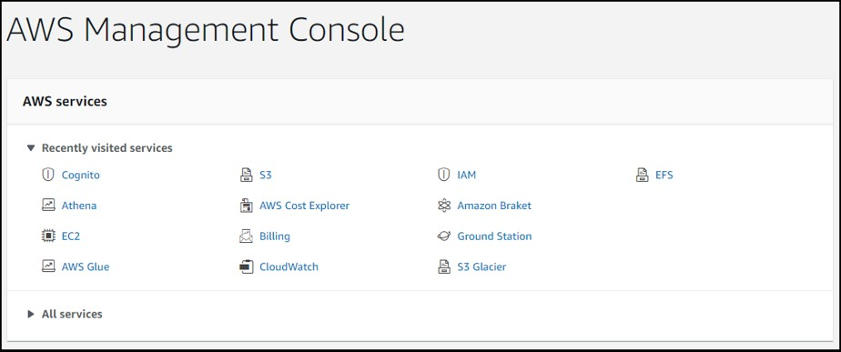

> **NOTE:** If you are logged out or get kicked out of the console, simply return to [https://codeathon.ncbi.nlm.nih.gov](https://codeathon.ncbi.nlm.nih.gov) and log in again (remember your newly created password!) to get back to the console home page.

> **NOTE:** This login method is unique to the workshop. If you want to create your own account after the workshop, visit the link below and follow the steps:
> [https://aws.amazon.com/premiumsupport/knowledge-center/create-and-activate-aws-account/](https://aws.amazon.com/premiumsupport/knowledge-center/create-and-activate-aws-account/)

# Objective 1 - Search for the sequence reads deposited into NCBI's SRA database using AWS Athena

## Creating an S3 Bucket

Before we can use Athena, we need to make an S3 bucket that we can save our results to as we search the SRA metadata tables. So, let's go make one!

1) Use the search bar at the top of the console page to search for **S3** and click on the first result

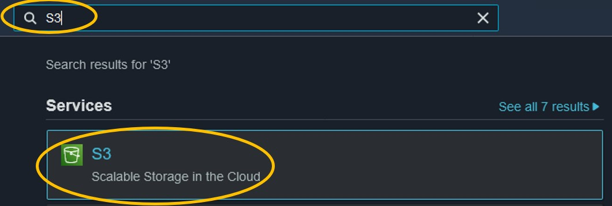

2) Click the orange **Create Bucket** button on the right-hand side of the screen


3) Enter a bucket name and make sure the region is set to `US East (N. Virginia) us-east-1`

**S3 bucket names must be completely unique.**

For this workshop, use the format `<username>-cloud-workshop` where `<username>` is the username you used to login


4) Scroll down to the **Block Public Access settings for this bucket** section. Deselect the blue checkbox at the top and select the bottom 2 checkboxes. Then check the box underneath the warning symbol to acknowledge your changes to the public access settings

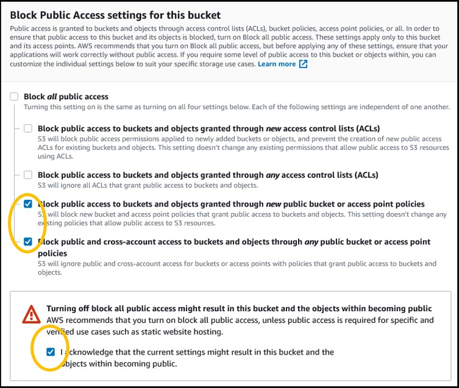

5) Ignore the rest of the settings and scroll to the bottom of the page. Click the orange **Create Bucket** button.

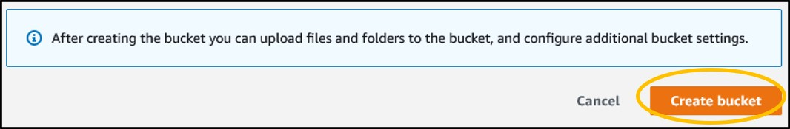

6) Clicking the button will redirect you back to the main S3 page. You should be able to find your new bucket in the list. If so, you have successfully created an S3 bucket!


Now that we have an S3 bucket ready, we can go see what the Athena page looks like!

## Navigating to Athena

1) Use the search bar at the top of the console page to search for **Athena** and click on the first result

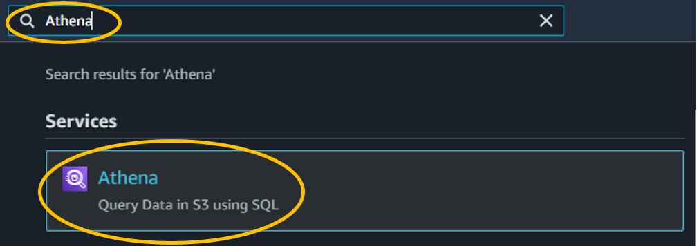

2) Visiting the Athena page should prompt you with a few notifications at the top of the page. you can just click the little "X" and disregard the first two.

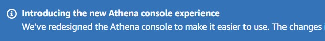

3) The third notification is actually very important .We need to tell Athena which S3 bucket we want all of our search results to be stored in. Good thing we just made one, eh?  Click **Settings** in the top right of the screen

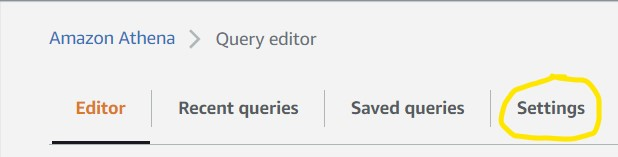

4) Click the folder button that says **Select** *(top image)* and scroll down to find your newly created S3 bucket. Then click the black arrow button to select it and the blue **Select** button to add it *(middle image)*. Finally, click **Save** *(bottom image)*.

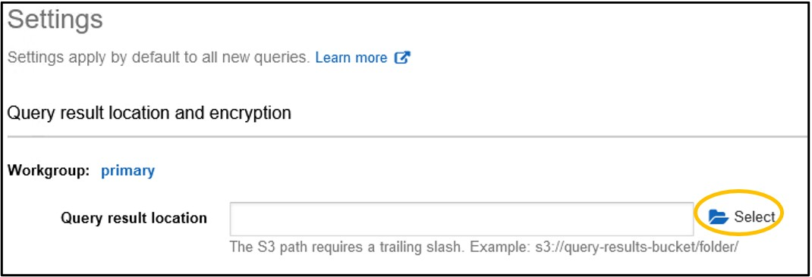

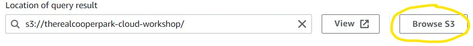

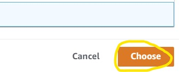

Now that we can save Athena results we can run some searches! The very last step to doing that is to import the table we want to search into Athena using another AWS service - Glue. However, to save time, this has already been done prior to the workshop by the instructor.

> For the detailed instructions on using AWS Glue to add a table to Athena, visit the Supplementary Text: **Instructions for AWS Glue**!

## Exploring Athena Tables

These steps aren't necessary to do before every Athena query, but they are useful when exploring a new table.

1) Click the dropdown menu underneath the **Database** section and click **sra** to set it as the active database. If you do not see this as an option, refresh the page and check again.

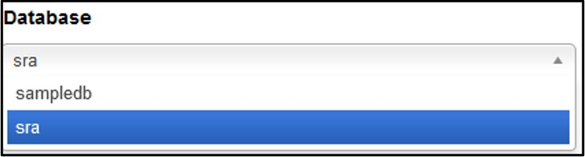

2) Look at the **Tables** section and click the ellipses next to the **metadata** table, then click **Preview Table** to automatically run a sample command which will give you 10 random lines from the table

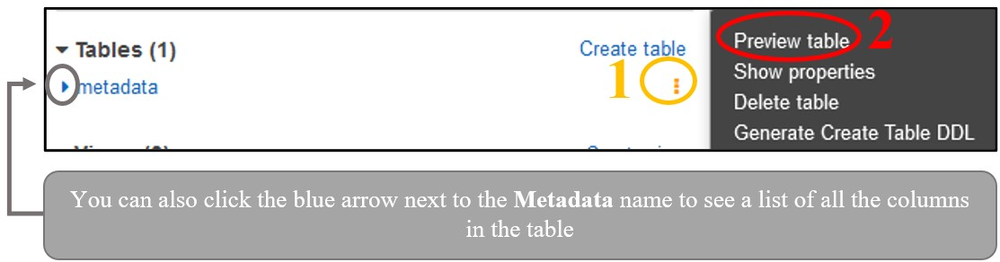

> For SRA based tables, you can also visit the following link to get the definition of each column in the table: [https://www.ncbi.nlm.nih.gov/sra/docs/sra-cloud-based-examples/](https://www.ncbi.nlm.nih.gov/sra/docs/sra-cloud-based-examples/)

## Querying Our Dataset

1) The following link is the actual publication for our case study today. Scroll to the very bottom and find the **Data Availability** section: [https://www.ncbi.nlm.nih.gov/pmc/articles/PMC5778042/](https://www.ncbi.nlm.nih.gov/pmc/articles/PMC5778042/)


> You can also use the SRA Run Selector on the NCBI website to download data from NCBI directly to your S3 bucket! Find more information and a tutorial here:  
> [https://www.ncbi.nlm.nih.gov/sra/docs/data-delivery/](https://www.ncbi.nlm.nih.gov/sra/docs/data-delivery/)

2) The paper stored the data we need under and ID **SRP125431**, but we don't know exactly which column that is associated with. So, scroll through the preview table we made earlier to find a column filled with similar values.


> The **Preview Table** query we used to make this example pulls random lines from the table, so the values within your table may look different from this screenshot. The important info for us is that each value in this **sra_study** column starts with **"SRP" (or "ERP")**

3) Now that we know which column to query for our data (sra_study), we can build the Athena query. Look to the panel where we enter our Athena queries. Click **New Query 1** to navigate back to the empty panel so we can write our own query.

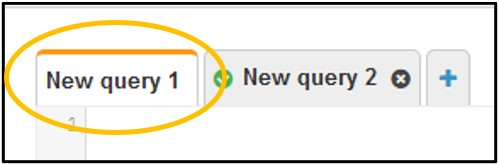

> Fun fact: If you navigate back to **New Query 2** you should still see the result table for that query! Athena will save that view for you until you run a new query in that tab or close the webpage.

4) Copy/paste the following command into the query box in Athena _(circled in yellow)_, then click the blue **Run Query** button _(circled in red)_.

```SQL
SELECT *
FROM "sra"."metadata"
WHERE sra_study = 'SRP125431'
```

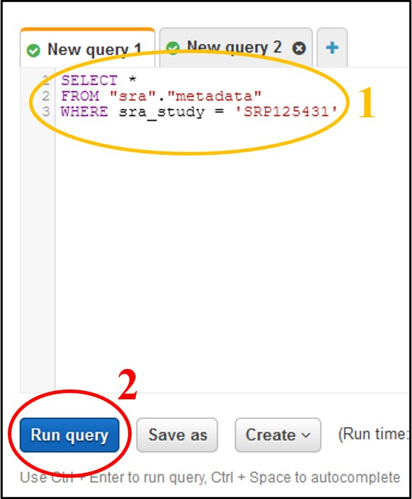

5) If you see a results table with three rows like the partial screenshot below, you have successfully found your data!

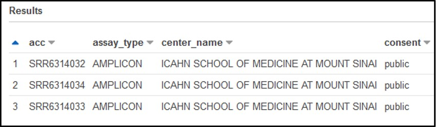

6) Click the **Download to CSV** button on the top-right corner of the results panel to download your file to your computer. You should be able to open this in Microsoft Excel, Google Sheets, or a regular text editor (e.g., Notepad for PC, TextEdit for Mac). We will review this file later, so keep it handy.

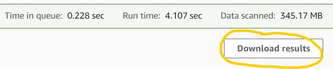

> Want to challenge yourself? Visit the supplementary text (section: **SQL challenges**) to find some questions you can build your own SQL query for. Plus, find more advanced SQL query techniques and a deeper breakdown of the SRA metadata table too!

# Objective 2 - Aligning Sequence Reads using AWS EC2 & MagicBLAST

## Launching an EC2 Instance

1) Use the search ar at the top of the console page to search for **EC2** and click on the first result

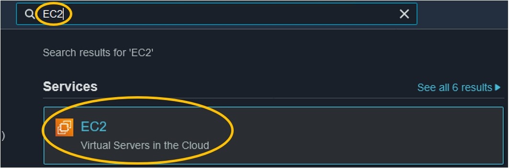

2) Scroll down a little and click the orange Launch Instance button and Launch Instance from its drop-down menu

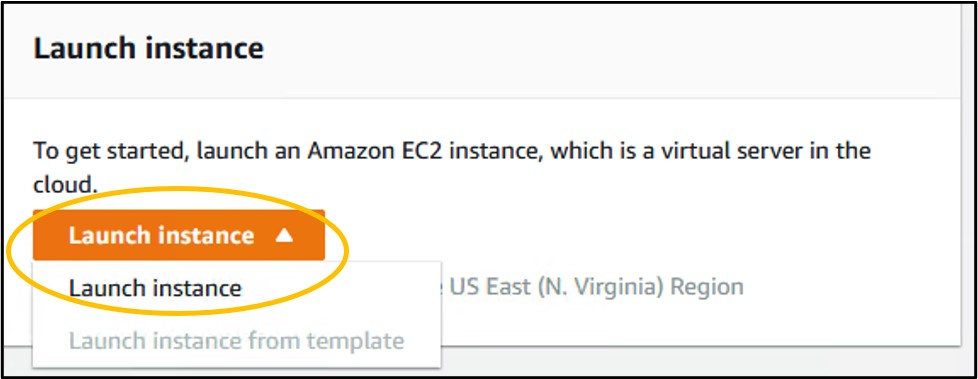

3) On the **Step 1: Choose an Amazon Machine Image (AMI)** page - type **Ubuntu** into the search bar and hit enter _(top image)_ then click the blue **Select** on the right hand-side of the **Ubuntu Server 20.04** image option _(bottom image)_.


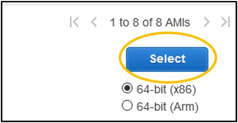

4) On the **Step 2: Choose an Instance Type** page - use the filter menus near the top of the menu to set the Instance Family to **m4**

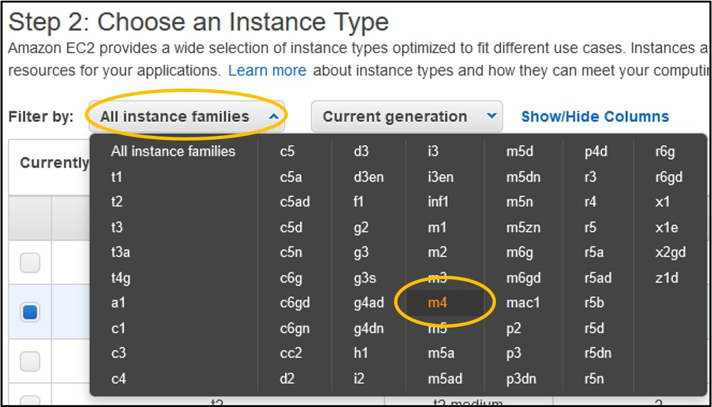

5) Look to the table below the filter buttons and check the box in the 2nd row from the top where the type is **m4.large**

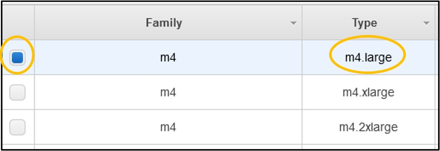

6) Click **Next: Configure Instance Details**


7) On page **Step 3: Configure Instance Details** - set the IAM role to **NCBI-Workshop-participant-EC2-instance** _(top image)_. Leave all other settings alone and click **Next: Add Storage** in the bottom right _(bottom image)_

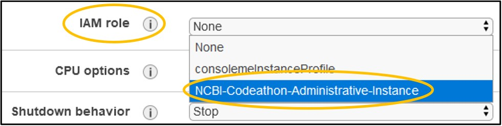


8) On page **Step 4: Add Storage** - Change the Size (GiB) to **30** _(top image)_, then click **Next: Add Tags** in the bottom right _(bottom image)_


9) On page **Step 5: Add Tags** - Click **Add Tag** on the left side of the screen _(top image)_. In the new row set the Key to be **Name** and the Value to be `<username>-cloud-workshop` just like we did with the S3 bucket earlier _(bottom image)_. Remember, `<username>` is the username you logged into the console with.

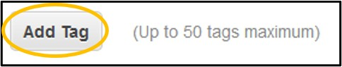


10) Click **Next: Configure Security Group** in the bottom right of the screen


11) On page **Step 6: Configure Security Group** - Near the top of the screen, click **Select an existing security group**. Then click the box of the **Default** row at the top.

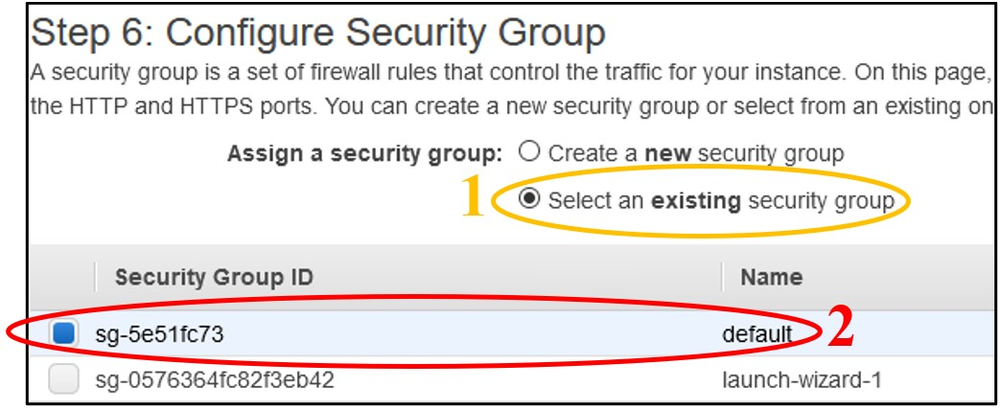

12) Click **Review and Launch** in the bottom right of the screen


13) On page **Step 7: Review and Launch** – You should see two warnings at the top of the screen denoted by the symbol below. You can disregard these.

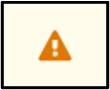

14) Click **Launch** in the bottom right of the screen.


15)	On the pop-up menu – change the first dropdown menu to **Proceed without a key pair** and check the box below it to acknowledge the change. Finally, click **Launch Instances** in the bottom right of the popup.


> **NOTE:** Key pairs are used to access the remote computer using other methods, like SSH. We won’t be using these other methods so we can skip the key pairs here without affecting our ability to do the workshop.

16)	On the **Launch Status** page – Click **View Instances** in the bottom right

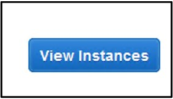

17)	On the **Instances** page – Find your instance in the table of created instances and look to the **Status Check** column to see the status of yours.


18)	Refresh the page occasionally until the **Status Check** column changes to **2/2 checks passed** for your instance. This means we can now log into the instance.


 
19) Check the box to the left of your instance name _(top image)_ to select the instance, then click **Connect** in the top right to head to the instance launcher _(bottom image)_

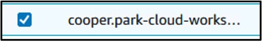


20) On the launcher page, click **Connect** in the bottom right. This will launch a new tab in your browser and connect you to your remote computer!

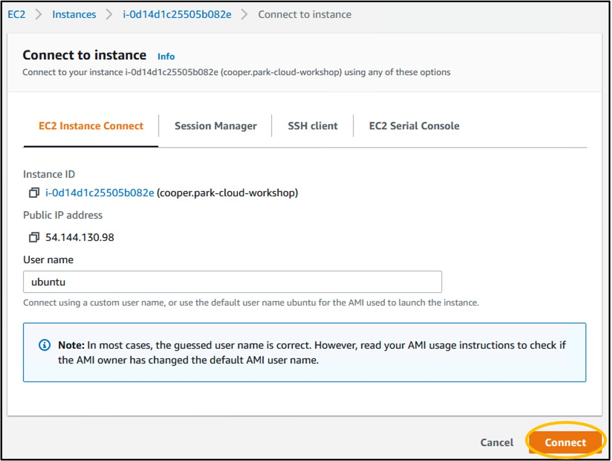

## Installing Software

Before we can do our analyses, we need to install some software into our new remote computer

1) First we need to update the pre-installed software in our terminal. Copy/paste the following command into your terminal, then hit **Enter**

```bash
sudo apt-get update
```

2) To download magicBLAST, copy/paste the following command into your terminal, then hit **Enter**

```bash
curl -o magicblast.tar.gz https://ftp.ncbi.nlm.nih.gov/blast/executables/magicblast/LATEST/ncbi-magicblast-1.6.0-x64-linux.tar.gz
```

3) We also need to unpack the software so we can run it. Run the following command to do that

```bash
tar -xvzf magicblast.tar.gz && chmod -R 755 ncbi-magicblast-1.6.0/
```

4) Next, we need to install samtools. Run the following command below to do that.

```bash
sudo apt install -y samtools
```

5) Finally, we need to install the AWS command line interface. Run the following commands to do that

```bash
sudo apt install -y unzip
```

```bash
curl -o awscliv2.zip https://awscli.amazonaws.com/awscli-exe-linux-x86_64.zip
```

```bash
unzip awscliv2.zip
```

```bash
sudo ./aws/install
```

## Mapping Reads with MagicBLAST

We can (finally) run MagicBLAST to align some reads! We just need two pieces of information to run the program.  
A.	The reference sequence – _Will be solved with Step 1 below_  
B.	The accession numbers for our reads – _Will be solved with Step 2 below_

1)	Based on the information from the manuscript, we know that the deleted region in the genome is on Chromosome 7. In NCBI, the accession number for this sequence is **NC_000007** so we can download this sequence to our remote computer and use it as the reference sequence for our alignment. Download the sequence using the following command.

```bash
curl -o chr7.fa 'https://eutils.ncbi.nlm.nih.gov/entrez/eutils/efetch.fcgi?db=nuccore&id=NC_000007&rettype=fasta'
```

2) Our Athena query gave us three different accession numbers that could be the child’s sequence data. To find out which one is associated with the child, scroll through the columns to find one that distinguishes each accession (_hint: it’s the library_name column_). 


3) It looks like **SRR6314034** is the ID we want! To run MagicBLAST on our selected accession ID, run the following command. This should take ~1 minute to run. You’ll know it worked okay if the command runs with NO output.

```bash
./ncbi-magicblast-1.6.0/bin/magicblast -subject chr7.fa -sra SRR6314034 -out SRR6314034.sam
```

4) Next, we need to format the output files so that we can use them in Genome Data Viewer. Run the following samtools commands to do this. it will run each samtools command in order automatically. Like above, if NOTHING happened after hitting enter, then it worked!

```bash
samtools view -S -b SRR6314034.sam > SRR6314034.bam
samtools sort SRR6314034.bam -o SRR6314034.sorted.bam
samtools index SRR6314034.sorted.bam SRR6314034.sorted.bam.bai
```

5) Now we'll move all these results files to a single folder so we can keep track of them

```bash
mkdir results && mv SRR* results/
```

6) Finally, we need to move these results files to our S3 bucket so we can access them outside of our AWS account. Run the following AWS CLI command to copy the files to your S3 bucket.  

> **REMEMBER:** You will need to replace the `<username>` piece of the command with your own login username to make it match your S3 bucket name. So copy/paste the command into your terminal, then use the arrow keys to move your cursor back through the string and change the name to your own bucket.

```bash
aws s3 sync results/ s3://<username>-cloud-workshop
```

7)	We should now be done with our remote computer (aka: EC2 instance). Go ahead and close the browser tab your instance is open in.


8)	In the console webpage, click the blue **Instances** button at the top of the instance launcher page


9) We don’t want to leave an instance on while not using it, because it costs money to keep it active. So, let’s shut it down, but not delete it, just in case we want to use it later. Check the box next to your instance _(top image)_ then click the **Instance State** drop-down menu and select **Stop Instance** _(bottom image)_.


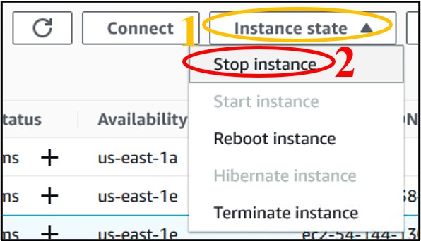

10) Finally, we need to check on the files in our S3 bucket and make them publicly available to upload the files to GDV later. Navigate back to the S3 page (use the search bar at the top of the console page) _(top image)_ and click on your bucket name _(bottom image)_ to see its contents


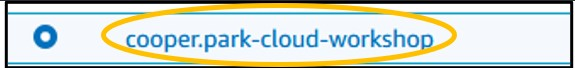

11) You should have four files in your bucket. We need the files that end in **sorted.bam** and **sorted.bam.bai**. Check the box next to each of those files _(top image)_ then use the Actions drop-down menu and select **Make Public** at the very bottom _(bottom image)_


12) On the new page, click the orange **Make Public** button in the bottom right of the page to make the files publicly accessible


13) If it works, you will see a green banner at the top of the new page like seen below _(top image)_. If you see this, click your bucket link under the “summary” panel _(bottom image)_ to navigate back to the main bucket page.

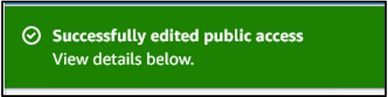

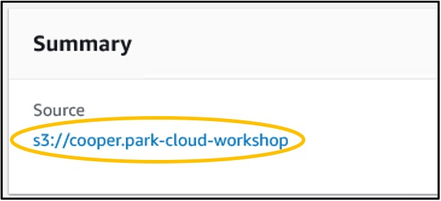

# Objective 3 - Visualize Read Alignments Using Genome Data Viewer

## Importing Our Data

1)	Open a new tab in your web browser and go to [https://ncbi.nlm.nih.gov/genome/gdv/](https://ncbi.nlm.nih.gov/genome/gdv/)

2)	Make sure the **Human** is selected from the tree on the left

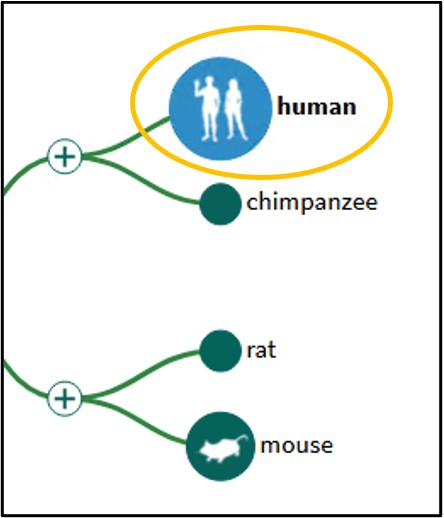

3)	Scroll to the bottom of the page and click on the 7th Chromosome image to load the Genome Data Viewer on the human reference genome’s 7th chromosome

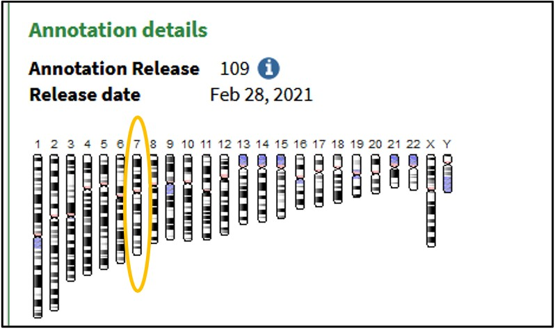

4)	The GDV page comes pre-loaded with several tracks aligned against the chromosome. Most of these are not useful to us today, so we can use the red X buttons in the top right corner of each track to delete them. Do this for every track **except the top one**. This top track shows every gene and its position on the chromosome.


> There are LOTS of NCBI-offered tracks you can upload ato compare against your own data. To learn more about them click the little gear at the bottom of the viewer page:  
> 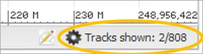

5) Now we can add our own tracks to the viewer. Click on **User Data and Track Hubs** on the left side of the screen

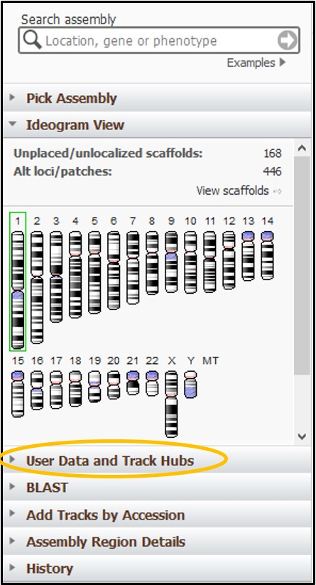

6) Click the **Options** pulldown menu and click **Add Remote Files...** 


7)	Navigate back to your S3 bucket tab and click on the **SRR6314034.sorted.bam** file to open up the details for the file


8) On the new page, click the "Copy" button next to the **Object URL** to copy the URL path to the file to your clipboard

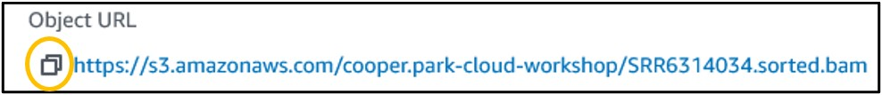

9) Go back to your GDV tab and paste the link into the URL box. Next, add a familiar name like `Child` to the **Name** box to help us identify the track later. Then click **Add**

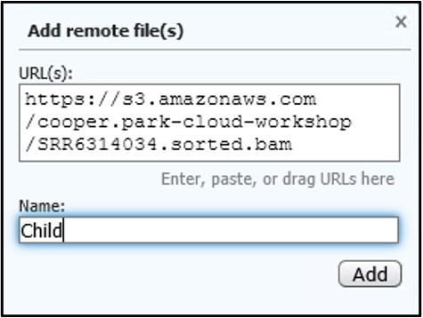

10) This track is showing all of the results of magicBLAST in a “pile-up” view. This is basically one long histogram plot where a taller bar represents a region of the chromosome where more reads from the sample aligned to. Because our sequences are specific to a single gene in the chromosome, but our current view is showing the entire chromosome, the pile-up view may look a little bland.  
Try to find the region of the chromosome that our reads aligned to:

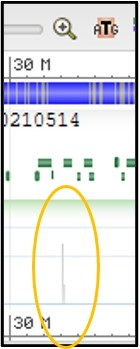

11)	Use the scale bar at the top of the viewer and click-and-drag across the section where our reads aligned to highlight it. Then use the pop-up menu to click **Zoom On Range**


12)	Repeat step 14 using the new view to refine the range again if the view didn’t change very much.


13)	Your view should now see the track similar to the screenshot below. If you don’t see the mess of red lines below the thick black bar, that’s okay! We will turn it off next anyway.

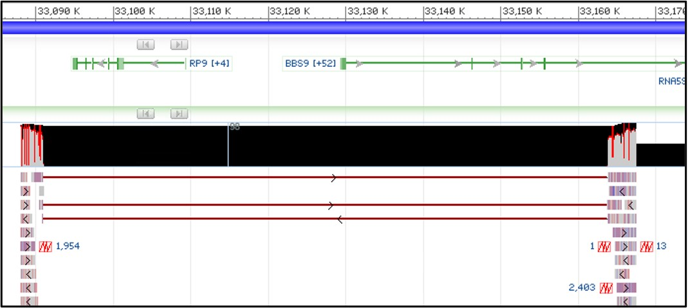

> **NOTE:** The tracks may be slightly different depending on how you have zoomed in. As long as you can see the image above somewhere on your screen you are doing great!

14) Those red lines underneath the thick black box are showing how each individual sequence read aligned to the reference sequence. This particular view isn’t very helpful to us, so let’s turn it off.

> **NOTE:** If you can’t see these lines, that’s great! You can skip Steps 15 & 16

15) Click the little gear in the top right corner of our Child track to open its settings.

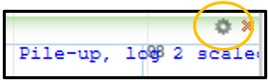

16)	On this new menu page, change the “Alignment Display” to “Packed” and then click **Accept**. You can change many other settings here as well, but I’ll leave that up to you to explore outside of this workshop.

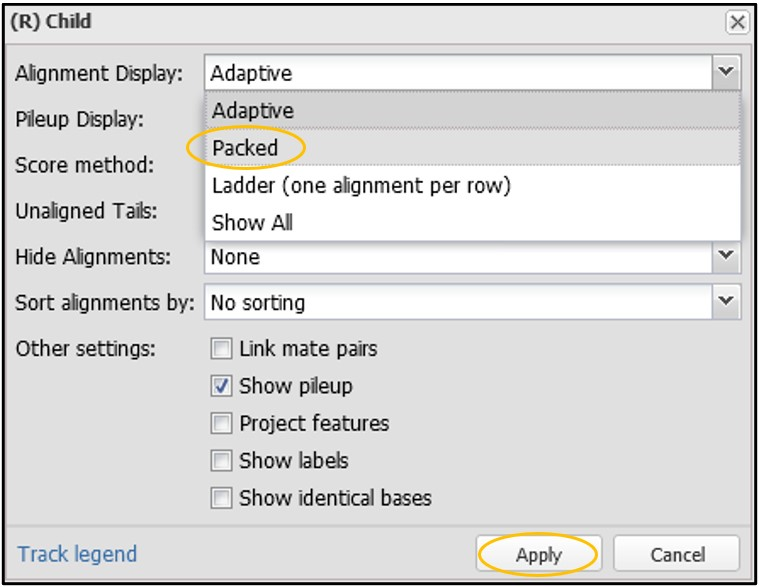

Now that we can see the range a bit better, let’s break down what each of these colors represent in the pile-up view:

- **Grey** – This is the standard “bar” for the pile-up view. The taller this bar is in a particular region, the greater the coverage is from the mapped reads.
- **Red** – These are locations in the genome where reads mapped, but with mismatches in the nucleotide sequence compared to the reference sequence.
- **Black** – These are gaps that exist in the read alignment to the reference genome (i.e., the reads only have a nucleotide sequence that covers before/after the large black chunk).

If you want to explore the pile-up view a bit more, try using the buttons in the toolbar just above the numeric range to navigate the assembly. Hold your mouse over the button for a description of what they can do!

## Adding NCBI Data

1)	Click the **Tracks** button in the bottom right corner of the viewer panel to open the Configure Page

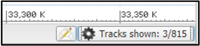

2) Click on the **Variation** tab and scroll way WAY down to the **dbVar** category. Then click the checkbox next to **dbVar Pathogenic Clinical Structural Variants** then click **Configure** in the bottom right corner of the page.

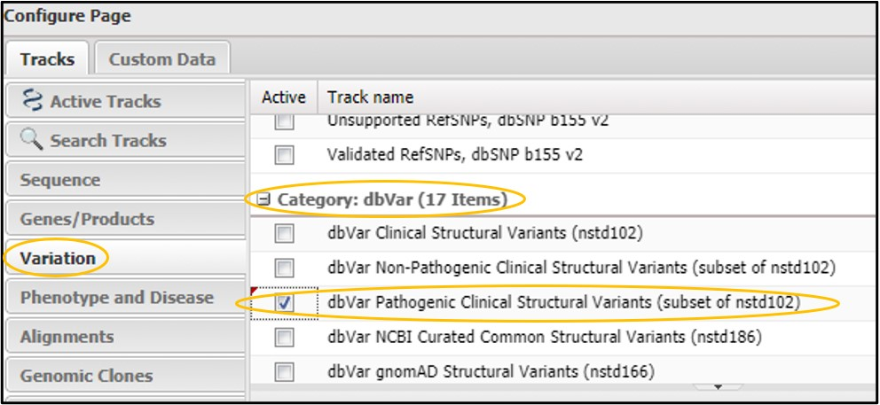

3) You should now have a new structural variants track loaded into the viewer. This track shows the region of the genome where each variant is found. Blue variants are caused by an insertion in this region, while Red variants are caused by a deletion. Because our alignment suggests a deletion, we want to focus on the red variants.

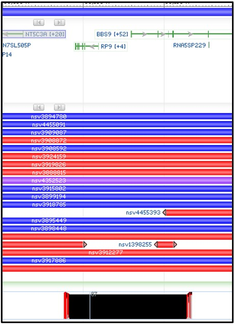

4) Next, zoom in on the right-half of our aligned region in the child track like the screenshot below. We want to look closely at the BBS9 gene to find structural variants that overlap with this region.


5)	Obviously, there are a LOT of variants that overlap in this region. However, our concern is only about our sequenced region of the gene. Variants which extend beyond our sequenced region are less likely to be relevant for us. So rather than just aimlessly checking every red variant, lets look only for variants that start or stop within our deletion.
 
Oh... there’s just one? Let's check that one then.

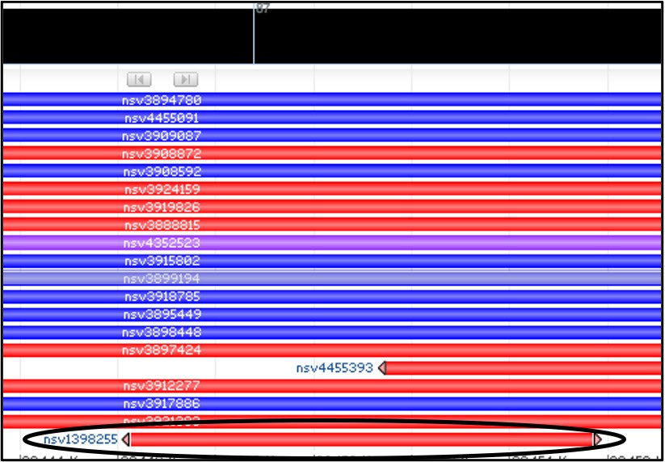

6)	Mouse over the variant **nsv1398255** to get a new pop-up menu and select the dbVar link at the bottom of it


7) On the dbVar page, navigate to the **Clinical Assertions** panel to see which clinical conditions have been associated with this deletion


8) Just as we suspected! This region is associated with Bardet-biedl syndrome. If we wanted to, we could click on the phenotype and explore more about the condition. But that is something you need to explore on your own, because this is the end of the worksheet!

# Conclusion

This concludes our exercise on navigating the AWS Cloud computing console and several of its most popular cloud services. We hope that you are motivated to take these skills and tools with you and explore how they can benefit your own research. You can find links to many useful resources to help you below.

- Case Study - [https://www.ncbi.nlm.nih.gov/pmc/articles/PMC5778042/](https://www.ncbi.nlm.nih.gov/pmc/articles/PMC5778042/)

**AWS**

- AWS Account Creation: [https://aws.amazon.com/premiumsupport/knowledge-center/create-and-activate-aws-account/](https://aws.amazon.com/premiumsupport/knowledge-center/create-and-activate-aws-account/)
- AWS Athena Documentation: [https://docs.aws.amazon.com/athena/](https://docs.aws.amazon.com/athena/)
- AWS Billing: [https://docs.aws.amazon.com/awsaccountbilling/latest/aboutv2/billing-what-is.html](https://docs.aws.amazon.com/awsaccountbilling/latest/aboutv2/billing-what-is.html)
- Cost Estimator: [https://calculator.aws/#/estimate](https://calculator.aws/#/estimate)
- AWS CLI Documentation: [https://docs.aws.amazon.com/cli/index.html](https://docs.aws.amazon.com/cli/index.html)
- AWS EC2 Instance Documentation: [https://docs.aws.amazon.com/ec2/index.html](https://docs.aws.amazon.com/ec2/index.html)
- AWS Glue Documentation: [https://docs.aws.amazon.com/glue/](https://docs.aws.amazon.com/glue/)
- AWS S3 Bucket Documentation: [https://docs.aws.amazon.com/s3/index.html](https://docs.aws.amazon.com/s3/index.html)

**Genome Data Viewer**

- Genome Data Viewer: [https://www.ncbi.nlm.nih.gov/genome/gdv/](https://www.ncbi.nlm.nih.gov/genome/gdv/)
- Sequence Viewer Documentation: [https://www.ncbi.nlm.nih.gov/tools/sviewer/](https://www.ncbi.nlm.nih.gov/tools/sviewer/)

**MagicBLAST**

- MagicBLAST Documentation: [https://ncbi.github.io/magicblast/](https://ncbi.github.io/magicblast/)
- MagicBLAST FTP page: [ftp://ftp.ncbi.nlm.nih.gov/blast/executables/magicblast/LATEST](ftp://ftp.ncbi.nlm.nih.gov/blast/executables/magicblast/LATEST)
- SamTools Documentation: [http://www.htslib.org/](http://www.htslib.org/)

**SRA**

- SRA Homepage: [https://www.ncbi.nlm.nih.gov/sra](https://www.ncbi.nlm.nih.gov/sra)
- SRA in the Cloud: [https://www.ncbi.nlm.nih.gov/sra/docs/sra-cloud/](https://www.ncbi.nlm.nih.gov/sra/docs/sra-cloud/)

# Supplementary Information

## Instructions for AWS Glue

In order search through a table (like the SRA metadata table) you need to load it into Athena. Because this is your first-time accessing Athena, it shouldn't be a surprise that you don't currently have any data tables loaded! Therefore, our first step will be to add the SRA metadata table to Athena. There are three ways you can add a table to Athena:

1.	Create the table using SQL commands (we are not SQL experts here...yet, so we won't do it this way)

2.	Add the table manually from an S3 bucket (although the SRA metadata is stored in its own S3 bucket, we don't know the format of the table, so we can't do it this way)

3.	**Use another AWS service called AWS Glue to automatically parse a table and load it into Athena for us using a "Crawler" (this is what we will do)**

> **Note:** Although AWS Glue is the most convenient method, it is also the only one to cost money. To parse the SRA metadata table it will be... ~$0.01.

This section will walk through the steps taken during the AWS Glue demo to prepare the SRA metadata table for Athena queries

1) To start working with AWS Glue, navigate to the **Tables** section of the Athena page on the left-hand side, then click **Create Table** and select **from AWS Glue Crawler** as seen below. If you see a pop-up about the crawler, just click **Continue**.


2) The settings for this crawler should e set as described below:

- Crawler name: This name needs to be informative, but not universally unique (like an S3 bucket). Choose something that helps you remember what the crawler is trying to access.

**Next page**

- Crawler Source Type: Keep the default setting (**data stores**)
- Repeat crawls of S3 data stores: Keep the default setting (**Crawl all folders**)

**Next page**

- Choose a data store: Set it to **S3**
- Connection: Leave empty
- Crawl data in: Select **Specified path in another account**
- Include path: This is the path to the table itself. The SRA metadata table used here is located at **s3://sra-pub-metadata-us-east-1/sra/metadata/**

**Next page**

- Add another data store: Select **No**. However, crawlers *can* parse multiple tables at a time, so you can add this if you want.

**Next page**

- Choose an IAM role: Work with your admin to determine the correct choice for you. If you are doing this on your own, I recommend creating your own IAM role and reusing it if you need additional crawlers.

**Next page**

- Frequency: Select **Run on Demand**. Crawlers can be run on specified intervals, but this costs extra money, and for most purposes is unecessary.

**Next page**

- Database: Select **Add database** then make a name for it. The tables parsed by this crawler will be stored in this database. Then click **Create**.
- Prefix added to tables (optional) - Leave empty.

**Next Page**

**Click Finish**

3) You should now be on the **Crawler** page for AWS Glue. Here you can manage and run crawlers. Click the checkbox next to the new crawler and select **Run Crawler**

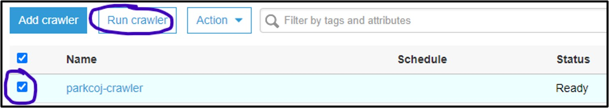

4) If it worked, you should see the **Status** column say **Ready** again, and the **Tables added** column should have changed to 1:


5) The table should now appear in Athena and you can follow the same steps described in section **Exploring Athena Tables** above.

## SQL Challenges

Now that you have a handle on how SQL commands work, let’s try some examples! Remember, you can use the “Tables” section on the left-hand side of the page to find out which columns you can filter by in your table.

If you find yourself stumped on the answer to any of these, or just want to check your answer, click the dropdown box underneath the question to reveal the solution and see a screenshot of the results table!

1. You just came across a new paper with lots of great sequence data. You want to add that data to your own research so you jump to the paper's Data Availability section (because all great computational papers have one!) and see that the data was stored in an SRA study under the accession SRP291000. Write a SQL command in the query terminal to find all data associated with the SRA study accession SRP291000:

<details>
  <summary>**Click to see solution!**</summary>
 
 ```SELECT * FROM "sra"."metadata" WHERE sra_study = 'SRP291000'```
 
 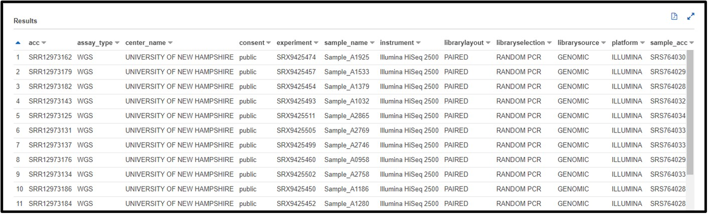
</details>


2.	You are working on a new genome assembly tool for short-read sequences. However, you don't have any reads of your own to test it! You know that SRA metadata includes the sequencing platform reads were generated on, so you decide you want to check there. Write a SQL command in the query terminal to find all data sequenced with the OXFORD_NANOPORE platform.

<details>
  <summary>**Click to see solution!**</summary>
 
 ```SELECT * FROM "sra"."metadata" WHERE platform = 'OXFORD_NANOPORE'```

 
</details>


Now let’s get a little bit more complicated with our queries by combining multiple filtering conditions together. For example, see the command below:


In this command we use the **AND** statement to add multiple requirements for our data. Specifically, we added a second criteria where the _consent = public_ (aka: The data is not under restricted access). Additionally, we add a more complex requirement by using an **OR** statement for the _platform_ column to ask for data that was generated by the _OXFORD_NANOPORE OR PACBIO_SMRT_ sequencing platforms. Overall, by running this command we will only get the data that fits all 3 conditions.

> **Note:** Make sure you include parenthesis around an OR statement as seen above, otherwise the query may not work as intended.

Here’s a few brain teasers to flex your new SQL skills! Remember, if you are stuck you can click the dropdown box underneath the question to reveal the solution and see a screenshot of the results table!

1.	After testing your genome assembly tool from earlier, you realize that not all Illumina datasets are created equally! It turns out you only need WGS (Whole Genome Sequencing) genomic data to properly validate your software. Also, you noticed that there was some metagenomic and transcriptomic data mixed in with your test cases. So, this time you are just going to look for “genomic” datasets. Write a SQL command in the query terminal to find all **WGS assay_type** data sequenced on the **ILLUMINA platform** and a **GENOMIC library_source**.

<details>
  <summary>**Click to see solution!**</summary>
 
 ```SELECT * FROM "sra"."metadata" WHERE platform = 'ILLUMINA' AND assay_type = 'WGS' AND librarysource = 'GENOMIC'```
 
 
</details>


2. You are designing a population-level epidemiological survey of some bacterial pathogens from samples collected across Europe. You decide you want to get some preliminary data on _Escherichia coli_ (or maybe _Staphylococcus aureus_...) from the SRA, but you aren’t picky about what kind of sequencing is done just yet. Write a SQL command in the query terminal to find all sequences collected from the **continent Europe** and are from the **organism Escherichia coli or Staphylococcus aureus**.

_Hint: The column header for the continent is not very intuitive. Try using the “Preview Table” option from the “Tables” tab described earlier to find a column that would fit._

<details>
  <summary>**Click to see solution!**</summary>
 
```SELECT * FROM "sra"."metadata" WHERE (organism = 'Escherichia coli' OR organism = 'Staphylococcus aureus') AND geo_loc_name_country_continent_calc = 'Europe'```

</details>
